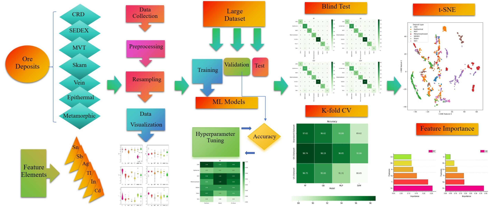

# Big Data Mining of Galena Geochemistry using Machine Learning



---

## Publication Status

This repository accompanies the peer-reviewed journal article:

**Big Data Mining on Galena Geochemistry Using Machine Learning Algorithms:  
Implications for Metallogenic Discrimination**

Published in **Mathematical Geosciences**.

**Citation:**  
Gul, M.A., Kanwal, A., Yang, X. *et al.* Big Data Mining on Galena Geochemistry Using Machine Learning Algorithms: Implications for Metallogenic Discrimination. *Mathematical Geosciences* (2026).  
https://doi.org/10.1007/s11004-026-10274-0

**DOI:** [10.1007/s11004-026-10274-0](https://doi.org/10.1007/s11004-026-10274-0)

The final published article is **not open access**. In accordance with publisher copyright policies, the full manuscript text is **not distributed** through this repository. Instead, this repository provides the **supporting machine-learning workflows, figures, and reproducible analyses** underlying the study.

---

## Overview

This study applies supervised machine-learning techniques to **LA-ICP-MS trace-element geochemistry of galena** in order to classify metallogenic deposit types and evaluate their geochemical discriminability.

A large and diverse global dataset of galena compositions is compiled and analyzed using multiple machine-learning algorithms. The objectives of this work are to:

- Quantify classification performance across deposit types
- Identify diagnostic trace elements controlling metallogenic signatures
- Explore galena geochemistry within a robust, data-driven metallogenic framework
- Support reproducible, data-driven mineral-deposit discrimination using machine learning

---

## Metallogenic Deposit Types Investigated

The study evaluates galena geochemistry from the following metallogenic deposit types:

- SEDEX
- Epithermal
- MVT (Mississippi Valley–Type)
- Metamorphosed
- Skarn
- Vein
- CRD (Carbonate-Replacement Deposits)

---

## Methods

The analytical and modeling workflow implemented in this repository includes:

- Data preprocessing and **z-score standardization**
- Class-imbalance handling using:
  - **SMOTE (Synthetic Minority Over-sampling Technique)**
  - **Random undersampling with clustering (RUC)**
- Supervised machine-learning models:
  - Random Forest (RF)
  - Gradient Boosting (GB)
  - Multi-Layer Perceptron (MLP)
  - Support Vector Machine (SVM)
- **Blind testing** and **k-fold cross-validation**
- Model performance evaluation using accuracy metrics and confusion matrices
- Feature-importance analysis
- **t-SNE** visualization for high-dimensional geochemical data exploration

---

## Repository Structure

```text
Galena-Geochemistry-ML-Metallogenic-Discrimination/
├── figures/
│   ├── graphical_abstract.png
│   └── README.md
│
├── notebooks/
│   ├── 1_Galena-RF.ipynb
│   ├── 2_Galena-GB.ipynb
│   ├── 3_Galena-MLP.ipynb
│   └── 4_Galena-SVM.ipynb
│
├── README.md
├── DISCLAIMER.md
└── .gitignore
```

---

## Notebook Description

The notebooks in this repository correspond to the main supervised machine-learning models used in the study.

| Notebook | Model | Purpose |
|---|---|---|
| `1_Galena-RF.ipynb` | Random Forest | Classification and feature-importance analysis |
| `2_Galena-GB.ipynb` | Gradient Boosting | Ensemble-based metallogenic classification |
| `3_Galena-MLP.ipynb` | Multi-Layer Perceptron | Neural-network-based classification |
| `4_Galena-SVM.ipynb` | Support Vector Machine | Kernel-based supervised classification |

---

## Reproducibility

All Jupyter notebooks provided in the `notebooks/` directory are designed to be **fully reproducible**, subject to data availability and computational environment.

Each notebook corresponds to a specific machine-learning model described in the published study. Users can inspect the workflow structure, preprocessing strategy, model-training procedure, performance evaluation, and visualization approach used for metallogenic discrimination of galena geochemistry.

Because the final published article is not open access and may include publisher-protected content, this repository does not distribute the full published manuscript.

---

## Citation

If you use this repository, workflow, figures, or machine-learning approach, please cite the published article:

```text
Gul, M.A., Kanwal, A., Yang, X. et al. Big Data Mining on Galena Geochemistry Using Machine Learning Algorithms: Implications for Metallogenic Discrimination. Math Geosci (2026). https://doi.org/10.1007/s11004-026-10274-0
```

BibTeX:

```bibtex
@article{Gul2026GalenaML,
  title   = {Big Data Mining on Galena Geochemistry Using Machine Learning Algorithms: Implications for Metallogenic Discrimination},
  author  = {Gul, Muhammad Amar and Kanwal, A. and Yang, X. and others},
  journal = {Mathematical Geosciences},
  year    = {2026},
  doi     = {10.1007/s11004-026-10274-0},
  url     = {https://doi.org/10.1007/s11004-026-10274-0}
}
```

---

## License and Disclaimer

This repository does **not** contain the final published manuscript or any publisher-copyrighted content. All rights to the published article remain with the publisher.

The code, figures, and workflows provided here are intended for **academic and research use** only. No warranty is provided regarding suitability for commercial or exploration decision-making.

For detailed copyright and usage information, see:

[`DISCLAIMER.md`](DISCLAIMER.md)

---

## Contact

**Dr. Amar Gul**  
Geoscientist | Machine Learning | Metallogenic Modeling  

GitHub: [https://github.com/Dr-Amar](https://github.com/Dr-Amar)
